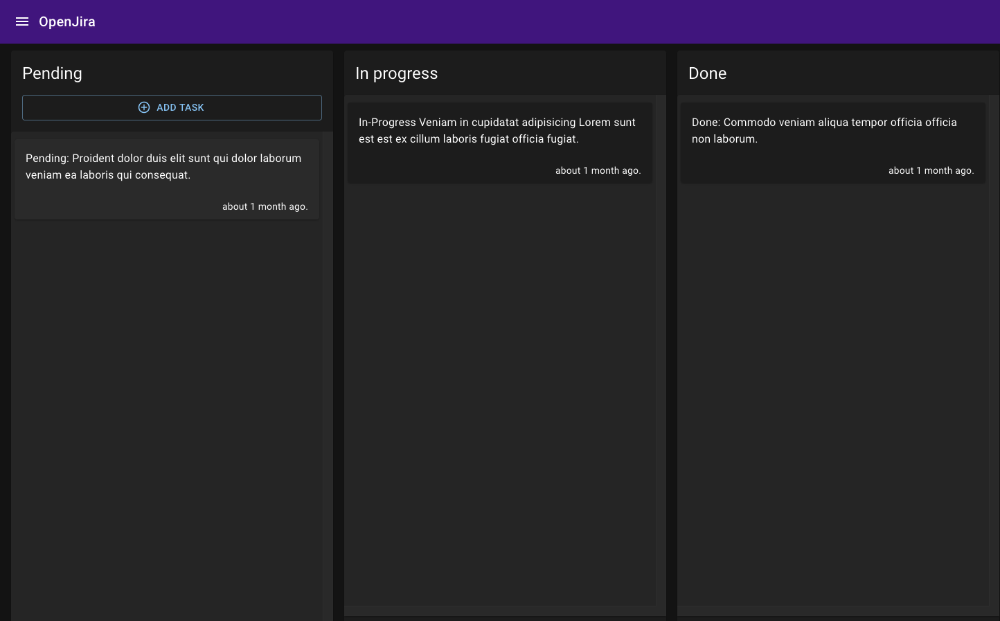
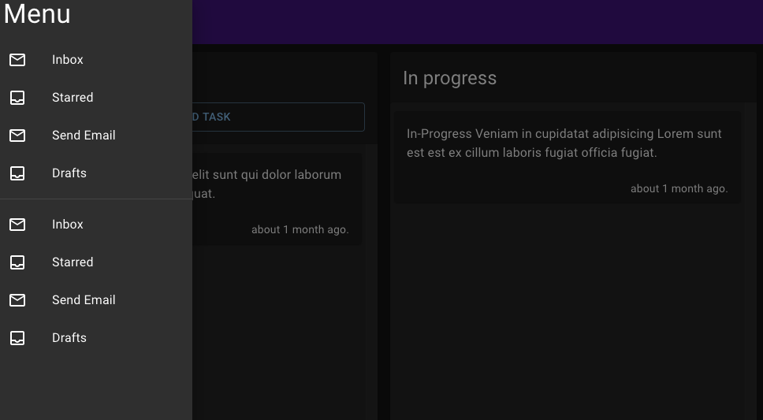
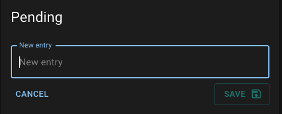
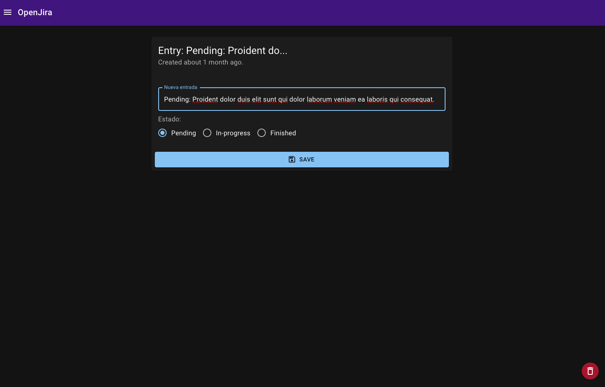

# Next.js Jiro App

## Description

The Jiro app is a simple app to manage your daily task, you can create, edit, delete and mark as done.

### start locally:

```
docker-compose up -d
```

- El -d, means **detached**

## Config the environment variables

Change **.env.template** to **.env**

- MongoDB URL Local:

```
MONGO_URL=mongodb://localhost:27017/entriesdb
```

## Install dependencies

```
npm i or yarn
```

## Run the app

```
npm run dev
or
yarn dev
```

## Data demo to data base.

call the endpoint:

```
http://localhost:3000/api/seed
```

## Screenshots

### home page



### menu page



### create entry



### edit entry


